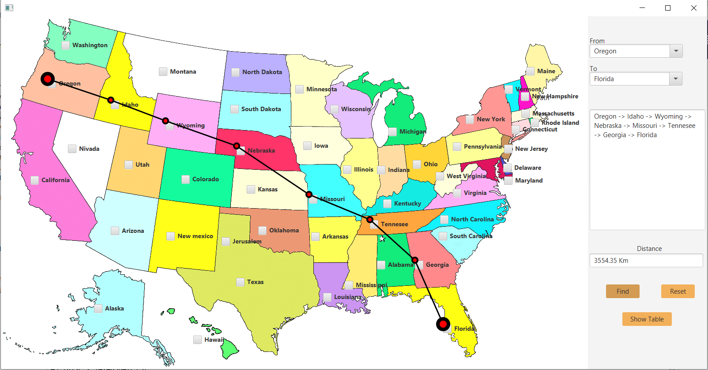

<h1>Dijkstra's Algorithm for Shortest Path</h1>
  
Welcome to the Dijkstra's Algorithm for Shortest Path repository! This project focuses on implementing and optimizing the classic Dijkstra's shortest path algorithm for maps. Such algorithms are widely used in geographic information systems (GIS), including MapQuest and GPS-based car navigation systems.

  <h2>Implementation Details</h2>
  <ul>
    <li>The program should allow the user to choose the cities through mouse input or keyboard.</li>
    <li>The shortest path between the selected cities should be displayed on the map.</li>
    <li>The project should include at least 50 cities to work with.</li>
  </ul>

  
